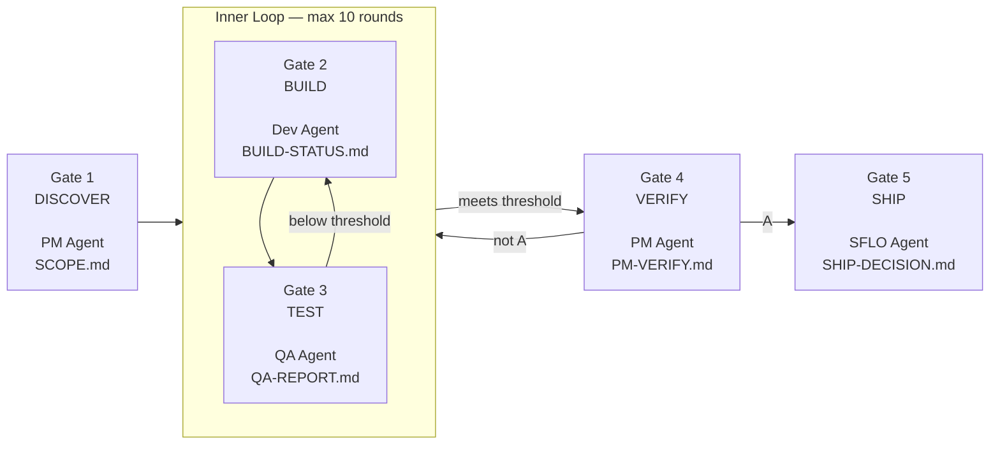
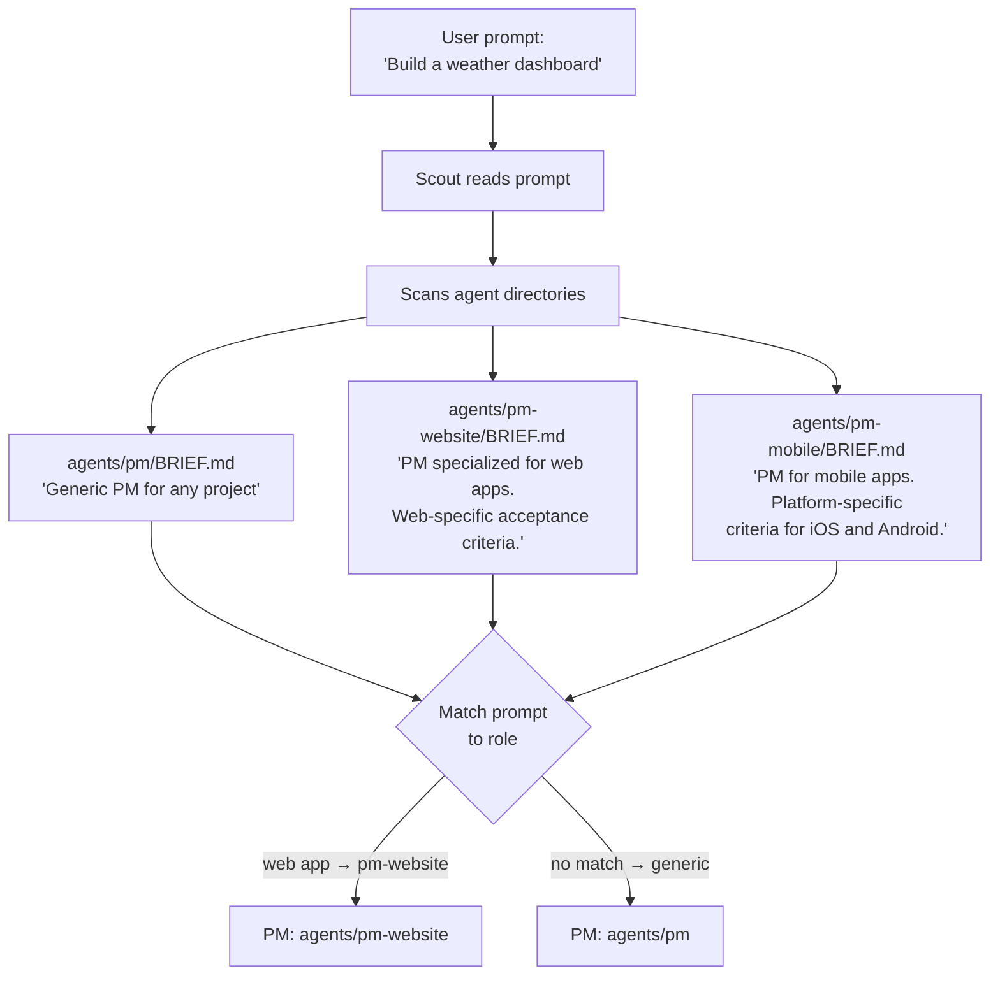

# SFLO — Simon Factory Lights Out

A gated pipeline protocol for building software with AI agents. Five gates — each producing a required artifact. No artifact, no progress. No skipping.



## Install

If you want to use v1 (no code) - get it from [here](https://github.com/simonasrazm/simon-factory-lights-out/commit/7c53dba87045d3ae80b4b01bb23d4cbf09941b84)

### Latest version install

Tell your AI agent:

> Install SFLO from https://github.com/simonasrazm/simon-factory-lights-out

The agent will clone the repo, run `setup.sh`, install the pipeline hook, and configure bindings. After a gateway restart (OpenClaw) or new session (Claude Code), SFLO is ready.

## Usage

Say **"SFLO: [describe what to build]"** to start the pipeline. Examples:

- "SFLO: build a job board website with search and filters"
- "SFLO: create a CLI tool that scans code for vulnerabilities"

The pipeline runs automatically — Scout picks the right agents, gates enforce quality, hooks keep it moving until done or escalated.

## Agents

Gates define **what** to produce. Agents define **how**. Each agent is a directory with a `SOUL.md` (methodology) and a `BRIEF.md` (one-paragraph description for Scout matching). See `docs/agent-spec.md` for the spec.

### How Scout picks agents

On user prompt, Scout scans `agents/` directory and reads each `BRIEF.md` to understand what the agent specializes in. It then matches agents to pipeline roles based on the user's prompt. Scout is an LLM agent.



**Example:** When the prompt says "build a weather dashboard," Scout reads all BRIEF.md files, sees that `pm-website` specializes in web apps, and assigns it as PM. If no better agent matches, Scout falls back to the generic agent (`agents/pm`).

### Adding your own agents

Create a directory with two files:

```
agents/
  my-pm-agent/
    BRIEF.md      ← one paragraph, tells Scout when to use this agent
    SOUL.md       ← full methodology, read by the agent at runtime
```

Scout will discover your agent automatically on the next pipeline run — no configuration needed.

## Contributing

See [CONTRIBUTING.md](CONTRIBUTING.md).

## License

[MIT](LICENSE)
