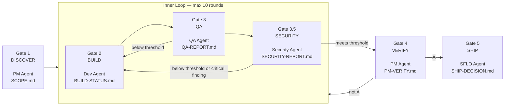
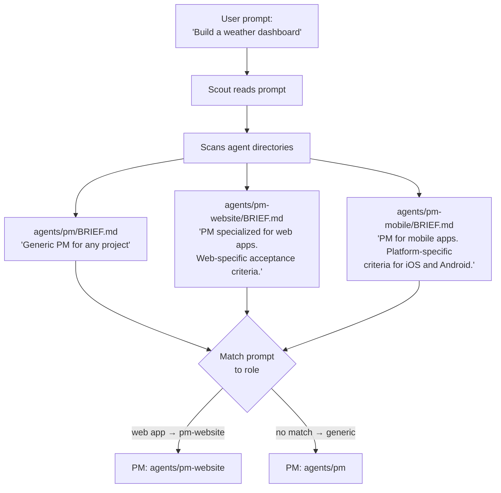

# SFLO — Simon Factory Lights Out

A gated pipeline protocol for building software with AI agents. Six sequential stages — each producing a required artifact. No artifact, no progress. No skipping.


```mermaid
flowchart LR
    G1["Gate 1<br/>DISCOVER<br/><br/>PM Agent<br/>SCOPE.md"] --> DEV_QA

    subgraph DEV_QA ["Inner Loop — max 10 rounds"]
        direction TB
        G2["Gate 2<br/>BUILD<br/><br/>Dev Agent<br/>BUILD-STATUS.md"] --> G3["Gate 3<br/>QA<br/><br/>QA Agent<br/>QA-REPORT.md"]
        G3 --> G35["Gate 3.5<br/>SECURITY<br/><br/>Security Agent<br/>SECURITY-REPORT.md"]
        G3 -- "below threshold" --> G2
        G35 -- "below threshold or critical finding" --> G2
    end

    G35 -- "meets threshold" --> G4["Gate 4<br/>VERIFY<br/><br/>PM Agent<br/>PM-VERIFY.md"]
    G4 -- "not A" --> DEV_QA
    G4 -- "A" --> G5["Gate 5<br/>SHIP<br/><br/>SFLO Agent<br/>SHIP-DECISION.md"]
```

## Install

If you want to use v1 (no code) - get it from [here](https://github.com/simonasrazm/simon-factory-lights-out/commit/7c53dba87045d3ae80b4b01bb23d4cbf09941b84)

### Latest version install

Tell your AI agent:

> Install SFLO from https://github.com/simonasrazm/simon-factory-lights-out

The agent will clone the repo, run setup, install the runtime skill, and configure the default files. Cursor installs a global `/sflo` skill under `~/.cursor/skills/` while keeping only the stop hook in the project. If a Cursor build exposes `~/.cursor/skills-cursor/` as its active skill root, setup also installs an SFLO-owned compatibility copy there.

SFLO vendors a pinned snapshot of [Matt Pocock's composable engineering skills](https://github.com/mattpocock/skills), including provenance in `vendor/mattpocock-skills/SFLO-VENDOR.md`. Skills are opt-in per gate through `skills:`. The Codex default attaches TDD plus code-review to Developer and code-review to QA because those treatments earned [professional comparative evidence](docs/evaluation.md); other roles remain skill-free. Add or change skills only when role-specific evaluation shows a measurable gain over that role's no-skill configuration. Role SOULs, gate documents, and artifact contracts remain authoritative when a supplemental skill describes an incompatible workflow. Custom runners own their prompts and are outside this automatic attachment boundary. Vendor updates are deliberate: replace the snapshot from a reviewed release commit, inspect the selected skill and companion-file diff, then run the full test suite and prompt-budget check.

Current SFLO defaults are tuned for Codex/OpenAI models in `pipeline.yaml`. On a new Cursor project, setup installs `pipeline-cursor.yaml` as the project `pipeline.yaml`; when a custom pipeline already exists, setup preserves it and writes the proposed defaults to `pipeline.yaml.sflo-default`. Claude defaults are preserved in `pipeline-claude.yaml`.

## Usage

Ask your agent to start an SFLO factory and describe what to build. Examples:

- "Use SFLO to build a job board website with search and filters"
- "Start an SFLO factory for a fancy click counter"
- Cursor: `/sflo build a job board website with search and filters`

The pipeline runs automatically. Scout picks the right agents, gates enforce quality, and the configured runtime keeps the flow moving until done or escalated.

### Factories

Each CLI run gets its own factory directory under `.sflo/`, named from the prompt or from `--factory NAME`. This lets multiple factories run in parallel against the same project without sharing `state.json`, locks, logs, or gate artifacts.

Useful commands from the SFLO checkout:

- `python3 src/runner.py --list`
- `printf '%s\n' 'continue the original task' | python3 src/runner.py --runtime <runtime> --resume fancy-click-counter`
- `python3 src/runner.py --kill fancy-click-counter`
- `python3 src/runner.py --clean-stale`

Pipeline starts and resumes require an explicit `--runtime`.

## Agents

Gates define **what** to produce. Agents define **how**. Each agent is a directory with a `SOUL.md` (methodology) and a `BRIEF.md` (one-paragraph description for Scout matching). See `docs/agent-spec.md` for the spec.

### How Scout picks agents

On user prompt, Scout scans `agents/` directory and reads each `BRIEF.md` to understand what the agent specializes in. It then matches agents to pipeline roles based on the user's prompt. Scout is an LLM agent.


```mermaid
flowchart TD
    P["User prompt:<br/>'Build a weather dashboard'"] --> S["Scout reads prompt"]
    S --> SCAN["Scans agent directories"]
    SCAN --> B1["agents/pm/BRIEF.md<br/>'Generic PM for any project'"]
    SCAN --> B2["agents/pm-website/BRIEF.md<br/>'PM specialized for web apps.<br/>Web-specific acceptance criteria.'"]
    SCAN --> B3["agents/pm-mobile/BRIEF.md<br/>'PM for mobile apps. Platform-specific<br/>criteria for iOS and Android.'"]
    B1 --> MATCH{"Match prompt<br/>to role"}
    B2 --> MATCH
    B3 --> MATCH
    MATCH -- "web app → pm-website" --> A["PM: agents/pm-website"]
    MATCH -- "no match → generic" --> G["PM: agents/pm"]
```

**Example:** When the prompt says "build a weather dashboard," Scout reads all BRIEF.md files, sees that `pm-website` specializes in web apps, and assigns it as PM. If no better agent matches, Scout falls back to the generic agent (`agents/pm`).

### Adding your own agents

Create a directory with two files:

```
agents/
  my-pm-agent/
    BRIEF.md      ← one paragraph, tells Scout when to use this agent
    SOUL.md       ← full methodology, read by the agent at runtime
```

Scout will discover your agent automatically on the next pipeline run — no configuration needed.

## Configuration

SFLO is config-driven via `pipeline.yaml`. The default pipeline is bundled with SFLO, Cursor has a runtime-specific `pipeline-cursor.yaml`, and Claude has `pipeline-claude.yaml`. You can override any runtime by placing your own `pipeline.yaml` in your project root.

`pipeline.yaml` is the source of truth for models, reasoning effort, thresholds, agents, vendor skills, custom gates, and runtime policy. See `pipeline.yaml` for the full default configuration with all options documented.

### Sequential QA and security

QA completes before the security review in the default pipeline. Each role writes its own report, and SFLO advances only when both artifacts satisfy their validators and thresholds. A full run invokes up to six sequential model roles and can take several minutes; the defaults prioritize professional reliability over minimum latency.

## Contributing

See [CONTRIBUTING.md](CONTRIBUTING.md).

## License

[MIT](LICENSE)
