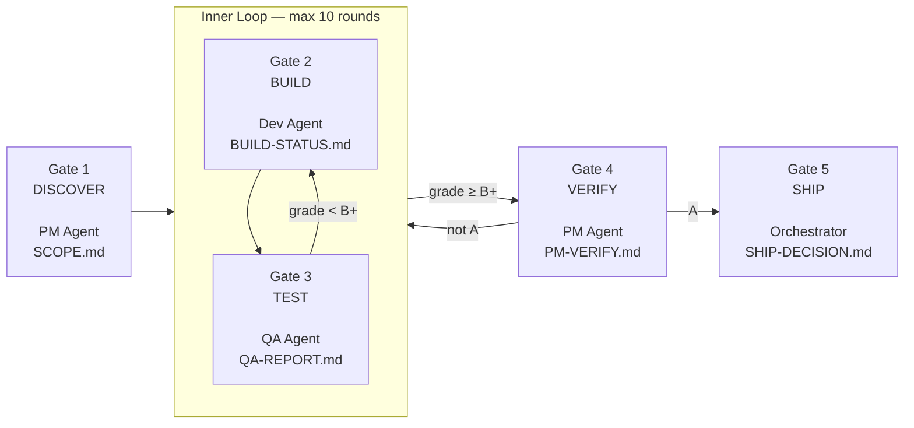

# SFLO — Core Pipeline

**Trigger:** User says "SFLO" or starts a new product increment.

## Pipeline Overview



**Two loops, not one:**

1. **Inner loop (Dev↔QA):** Dev builds, QA tests. If QA grade < B+, back to Dev. Max 10 rounds.
2. **Outer loop (PM):** Once QA passes (B+), PM verifies against spec. If PM doesn't grade A — back to the Dev↔QA loop with PM's deviation list.

## Gate Rules

1. **Gate 2 CANNOT start** without Gate 1's SCOPE.md existing and having verified data endpoints
2. **Gate 3 CANNOT start** without a successful build (zero errors)
3. **Gate 4 CANNOT start** without QA grade of B+ or higher
4. **Gate 5 CANNOT start** without PM Verification verdict: APPROVED
5. **Each gate produces a file** — no file = gate not passed

## Fail Loops

- **QA fails (grade < B+):** Loop back to Dev. Max 10 Dev↔QA cycles.
- **PM rejects (not A):** Loop back to Dev↔QA with PM's deviation list. The inner loop counter resets.
- **After 10 failed inner cycles:** Escalate to human. Something is fundamentally wrong.

## Orchestrator Responsibilities

The orchestrating agent (the one running SFLO) MUST:

1. **Never skip gates** — even if "it looks fine"
2. **Verify artifact files exist** before proceeding
3. **Track iteration count** — post status after each gate
4. **Keep all evidence** in the project directory
5. **Reference predecessor artifacts** — don't summarize, point to files
6. **Each agent reads its gate doc** — no relying on the orchestrator's summary
7. **Artifacts are the truth** — if it's not in a file, it didn't happen
8. **Fresh agents for QA** — don't let the builder test their own work

## Status Format

After each gate, post:

```
SFLO Pipeline: [Project Name]

Gate 1 (Discover): DONE — SCOPE.md verified
Gate 2 (Build):    DONE — build passes
Gate 3 (Test):     IN PROGRESS — Round 2/10 (grade C, fixing issues)
Gate 4 (Verify):   WAITING
Gate 5 (Ship):     WAITING

Current: QA found 3 issues, Dev fixing
```

## Emergency Override

Only the human owner can override this pipeline. If they say "ship it anyway" — ship it. But log the override in SHIP-DECISION.md with reason.

No agent can self-override. No "it's good enough" shortcuts.

## Retrospective

After every project completes (ship or kill), write:

```markdown
## Retrospective: [Project]

Iterations: PM [N] → Dev [N] → QA [N] → Verify [N]
Total time: [X hours]
Final grade: [A/B+]

What worked:
- [specific]

What broke:
- [specific] → [prevention]
```
